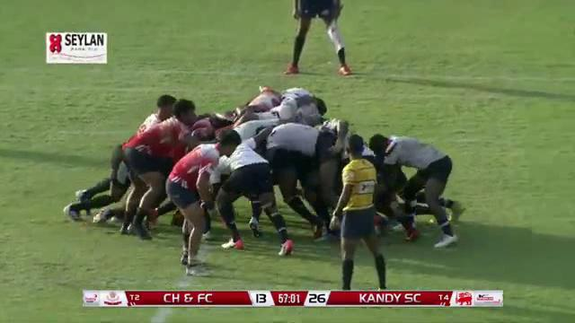
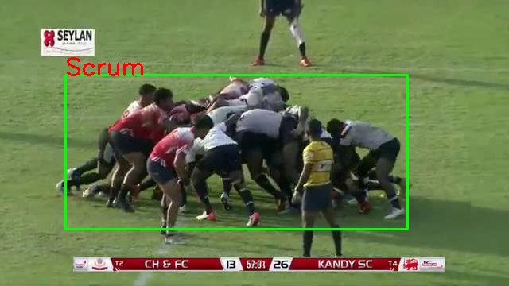

# Image Annotations

## Introduction

These are the image annotations with the bounding box information.

All annotations are in Yolo-v5 format.
### Yolo v5 format
| class_id | x_center | y_center | width | height |
| --- | --- | --- | --- | --- |
All the values are normalized to [0, 1].

example:
+ Original Image

+ Annotations
```text
0 0.4640625 0.5305555555555556 0.671875 0.5388888888888889
```
+ Annotation visualization


### Class IDs

| Event Type | Class ID |
| --- | ----------- |
| Scrum | 0 |
| Lineout | 1 |
| Ruck | 2 |


### No of Annotations

| Event Type | No of Images | No of Annotations |
| --- | ----- | ------ |
| Scrum | 1,301 | 1,293 |
| Lineout | 1,281 | 1,278 |
| Ruck | 1,646 | 1,654 |

| Type | Total |
| --- | ----- |
| Images | 4,228 |
| Annotations | 4,225|


## Example visualizations

Example visualizations for the annotated images, can be found in the [image-annotations]()

1. Scrum Annotation


2. Lineout Annotation


3. Ruck Annotation


