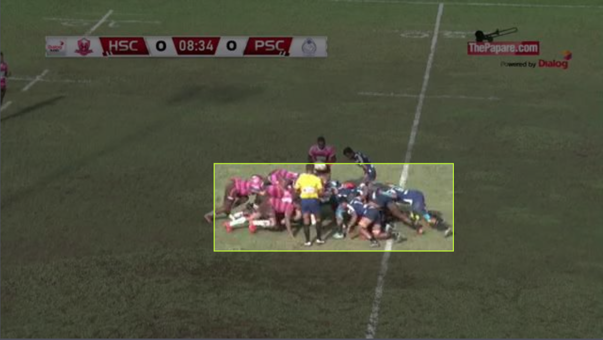
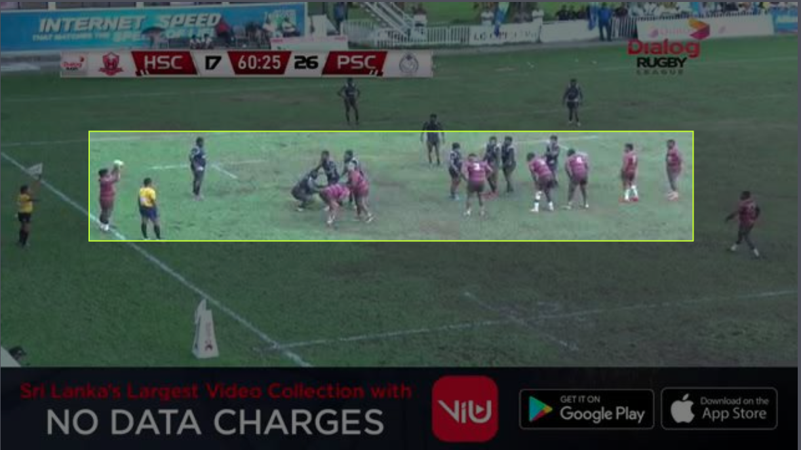
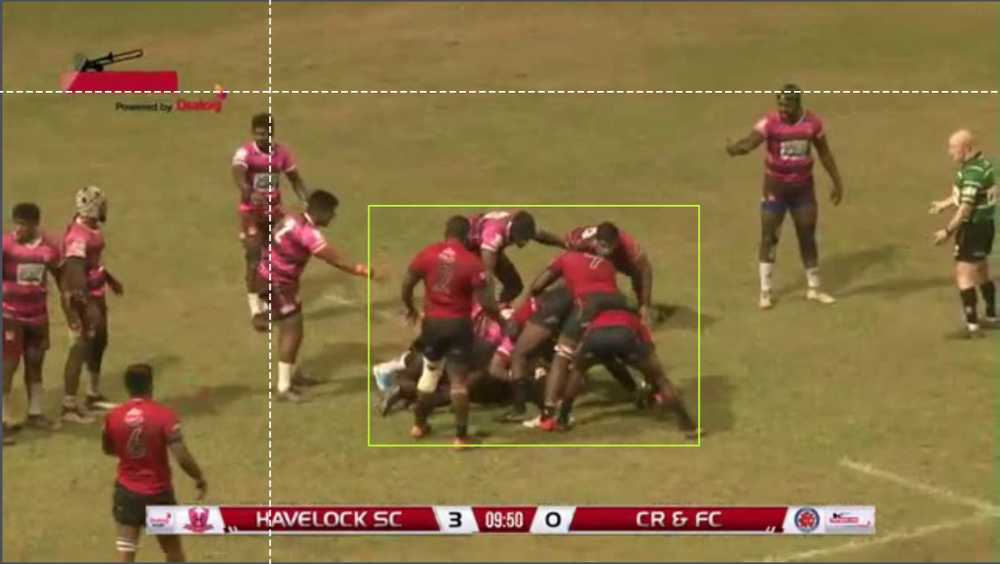

# Image Annotations

## Introduction

These are the image annotations with the bounding box information.

All annotations are in Yolo-v5 format.

### Class IDs

| Event Type | Class ID |
| --- | ----------- |
| Scrum | 0 |
| Lineout | 1 |
| Ruck | 2 |

### No of Annotations

| Event Type | No of Images | No of Annotations |
| --- | ----- | ------ |
| Scrum | 1,301 | 1,293 |
| Lineout | 1,281 | 1,278 |
| Ruck | 1,646 | 1,654 |

| Type | Total |
| --- | ----- |
| Images | 4,228 |
| Annotations | 4,225|

## Example visualizations

Example visualizations for the annotated images, can be found in the [image-annotations]()

1. Scrum

2. Lineout

3. Ruck

## Class IDs

